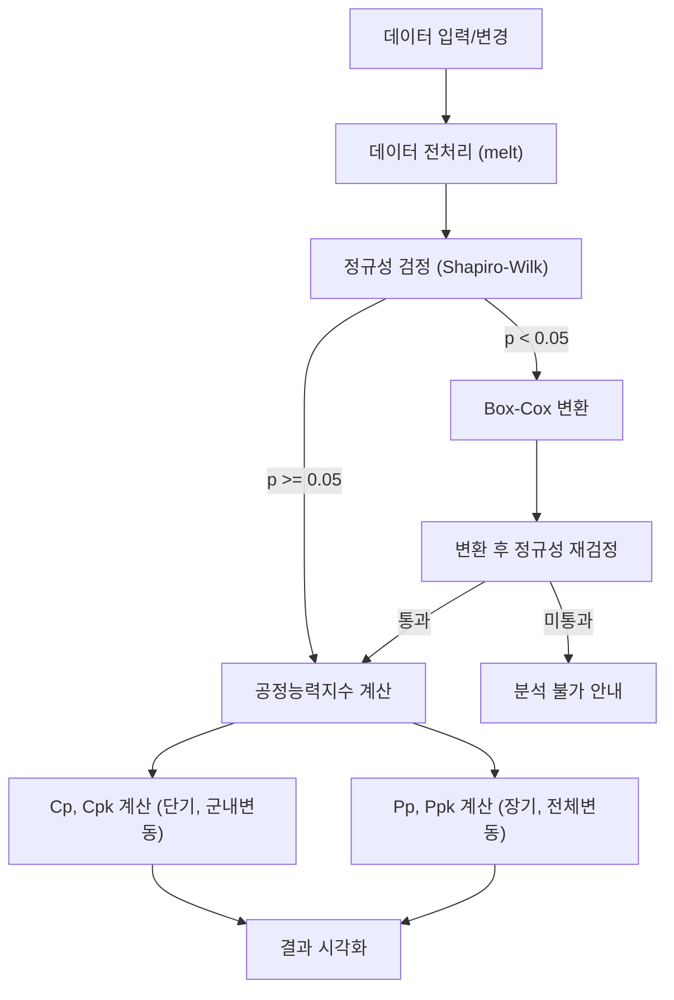
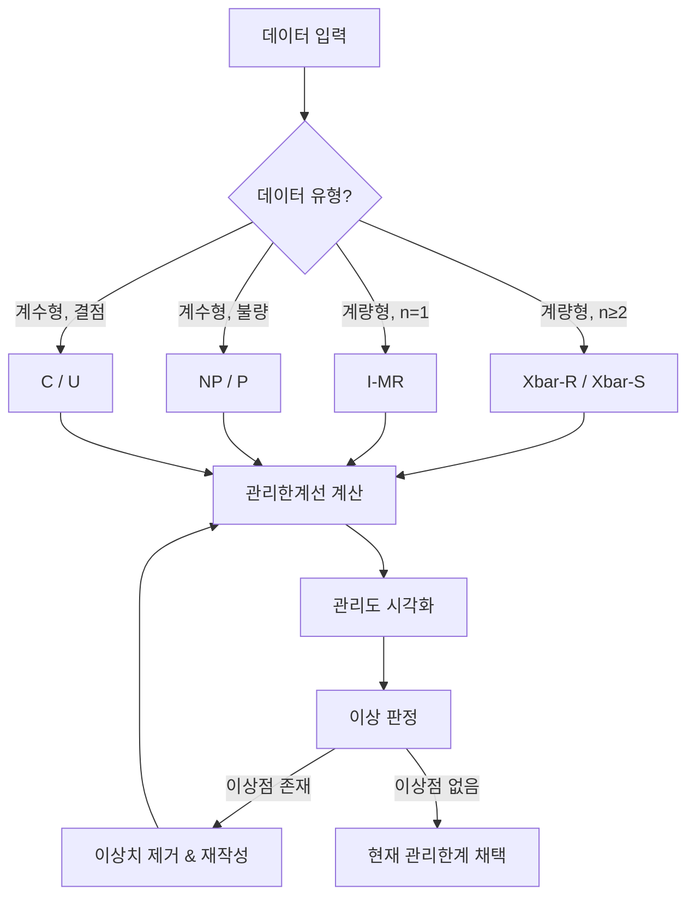
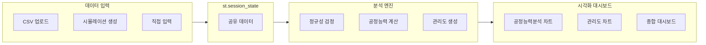

# 공정능력분석 & 통계적공정관리 Streamlit 웹앱 기획

## 1. 프로젝트 개요

### 목적
`codesplus.md`의 **08장 공정능력분석(Process Capability Analysis)**과 **09장 통계적공정관리(Statistical Process Control)** 내용을 기반으로, 사용자가 데이터를 입력/변경하면 실시간으로 공정능력분석 및 통계적공정관리를 수행하고, 다양한 시각화 대시보드를 통해 현재 공정 상황을 종합적으로 판단할 수 있는 Streamlit 웹앱을 개발합니다.

### 기술 스택
| 항목 | 기술 |
|------|------|
| 프레임워크 | **Streamlit** |
| 데이터 처리 | Pandas, NumPy |
| 통계 분석 | SciPy (shapiro, boxcox, zscore, probplot, norm, gamma) |
| 시각화 | Plotly (graph_objects, express, subplots) |
| 언어 | Python 3.10+ |

---

## 2. 핵심 요구사항

1. **데이터 유연성**: 데이터가 변경되면 새로운 공정능력분석 + 통계적공정관리를 즉시 수행
2. **시각화 대시보드**: 다양한 차트를 통해 현재 공정 상황을 직관적으로 판단
3. **교육 목적 적합**: 수업 내용(codesplus.md)에 기반한 분석 로직 충실 반영

---

## 3. 앱 구조 및 페이지 설계

### 3.1 전체 구조 (멀티페이지)

```
📦 spc_webapp/
├── app.py                          # 메인 엔트리포인트 (홈/대시보드)
├── pages/
│   ├── 1_📊_공정능력분석.py         # Process Capability Analysis
│   ├── 2_📈_관리도.py               # Control Charts (SPC)
│   └── 3_📋_종합_대시보드.py        # 종합 대시보드
├── utils/
│   ├── data_generator.py           # 시뮬레이션 데이터 생성 함수
│   ├── capability_analysis.py      # 공정능력분석 핵심 로직
│   ├── control_chart.py            # 관리도 생성 로직
│   ├── unbiased_constants.py       # 불편화 상수 계산
│   └── visualization.py           # 시각화 공통 함수
├── data/
│   ├── unbiased_capability_analysis.csv  # 불편화 상수 테이블 (공정능력)
│   └── unbiased_control_chart.csv       # 불편화 상수 테이블 (관리도)
└── requirements.txt
```

---

### 3.2 페이지별 상세 설계

---

#### 🏠 홈 / 대시보드 (`app.py`)

**역할**: 앱 소개 및 전체 공정 상태 요약

**구성 요소**:
- 앱 타이틀 및 설명 (스마트제조 - 공정능력분석 & 통계적공정관리)
- 현재 로드된 데이터의 기본 통계 요약 (KPI 카드)
  - 전체 평균, 전체 표준편차, 데이터 포인트 수
  - 현재 Cp, Cpk, Pp, Ppk 요약 표시
- 공정 상태 신호등 (🟢 양호 / 🟡 주의 / 🔴 부적합)
- 각 페이지로의 네비게이션 안내

---

#### 📊 페이지 1: 공정능력분석 (`1_📊_공정능력분석.py`)

**역할**: 데이터 입력/변경 → 공정능력분석 수행 → 결과 시각화

**① 데이터 입력 섹션** (사이드바)

| 입력 방식 | 설명 |
|-----------|------|
| **CSV 파일 업로드** | `st.file_uploader`로 실제 데이터 업로드 |
| **시뮬레이션 데이터 생성** | 슬라이더/입력으로 파라미터 조정 후 데이터 자동 생성 |
| **직접 입력** | 소규모 데이터 수동 입력 (st.data_editor) |

시뮬레이션 데이터 생성 파라미터 (codesplus.md의 `generate_data` 함수 기반):
- `var_name`: 변수명 (text_input)
- `target`: 목표값 (number_input)
- `tolerance`: 허용오차 (number_input)
- `sg_name`: 부분군명 (text_input)
- `num_sg`: 부분군 개수 (slider, 1~20)
- `sg_size`: 부분군 당 표본 크기 (slider, 2~100)
- `sg_std`: 부분군 표준편차 (number_input)
- `mean_shift`: 평균 이동 범위 (slider)

규격 설정:
- `USL`: 규격상한 (number_input)
- `LSL`: 규격하한 (number_input)

> [!IMPORTANT]
> 데이터가 변경(업로드/파라미터 조정)되면 하위 모든 분석이 자동으로 재수행됩니다. Streamlit의 반응형 특성을 활용합니다.

**② 데이터 탐색 섹션**

- 원시 데이터 테이블 표시 (`st.dataframe`)
- 기술통계량 요약 (전체 평균, 표준편차, 최소/최대, 부분군별 통계)
- **박스플롯**: 부분군별 데이터 분포 비교 (Plotly `px.box`)
- **히스토그램**: 부분군별/전체 데이터 분포 + USL/LSL 표시 (Plotly `px.histogram`)

**③ 정규성 검정 섹션**

- **Shapiro-Wilk 검정** 결과 표시
  - p-value, 검정통계량, 판정 결과 (정규성 만족/불만족)
  - 판정 결과에 따른 색상 표시 (🟢 만족 / 🔴 불만족)
- **Q-Q Plot**: 데이터의 정규성 시각적 확인 (Plotly scatter + 기준선)
- 정규성 불만족 시:
  - Box-Cox 변환 자동 수행
  - 변환 전/후 히스토그램 비교
  - 변환 후 정규성 재검정
  - 변환된 데이터 기준 공정능력지수 계산

**④ 공정능력지수 계산 및 시각화 섹션**

불편화 상수 계산 (`calc_unbiased_const` 함수 활용):
- d2, c4 등 불편화 상수 자동 계산 및 표시

공정능력지수 결과 테이블:

| 지표 | 값 | 판정 | 설명 |
|------|-----|------|------|
| **Cp** | 계산값 | 🟢/🟡/🔴 | 잠재 공정능력 (군내변동, 산포만 고려) |
| **Cpk** | 계산값 | 🟢/🟡/🔴 | 실제 잠재 공정능력 (치우침 + 산포) |
| **Pp** | 계산값 | 🟢/🟡/🔴 | 장기 공정능력 (군내+군간변동) |
| **Ppk** | 계산값 | 🟢/🟡/🔴 | 실제 장기 공정능력 |

판정 기준 (codesplus.md 기반):
- Cpk ≥ 1.33: 🟢 충분 (양호)
- 1.00 ≤ Cpk < 1.33: 🟡 보통 (3σ 수준, 개선 권장)
- Cpk < 1.00: 🔴 부족 (즉시 개선 필요)

**공정능력분석 종합 그래프** (`plot_process_capability` 기반):
- 히스토그램 + 박스플롯 + 정규분포 커브 오버레이
- USL/LSL 경계선 표시
- Cp, Cpk, Pp, Ppk 값 주석 표시
- 부분군별 색상 구분

---

#### 📈 페이지 2: 관리도 (통계적공정관리) (`2_📈_관리도.py`)

**역할**: 다양한 관리도 생성 및 이상 판정

**① 데이터 입력 섹션** (사이드바)

계량형 데이터 생성 (`generate_value_data` 기반):
- `var_name`, `target`, `sg_name`, `num_sg`, `sg_size`, `sg_std`, `mean_shift`, `sg_size_variation`

계수형 데이터 생성 (`generate_count_data` 기반):
- `var_name`, `sg_name`, `num_sg`, `sg_size`, `p` (불량률/결함률), `sg_size_variation`

CSV 업로드도 지원

**② 관리도 유형 선택**

`st.selectbox` 또는 `st.tabs`로 관리도 유형 선택:

| 카테고리 | 관리도 유형 | 적용 조건 |
|----------|------------|-----------|
| **계량형** | Xbar-R | 부분군 크기 ≥ 2 (소규모, 일반적으로 2~10) |
| **계량형** | Xbar-S | 부분군 크기 ≥ 2 (대규모, 일반적으로 10 이상) |
| **계량형** | I-MR | 부분군 크기 = 1 (개별값) |
| **계수형** | NP | 불량개수, 표본 크기 일정 |
| **계수형** | P | 불량률, 표본 크기 변동 가능 |
| **계수형** | C | 결점수, 검사 단위 일정 |
| **계수형** | U | 단위당 결점수, 검사 단위 변동 가능 |

**③ 관리도 시각화** (`plot_variable_control_chart` 기반)

각 관리도는 Plotly 서브플롯으로 표시:
- **관측치 (point)**: 선+마커 그래프
- **중심선 (CL)**: 초록색 점쇄선
- **관리상한선 (UCL)**: 마젠타색 점선
- **관리하한선 (LCL)**: 빨간색 점선
- 각 한계선의 수치값 주석 표시

관리도 세부정보 테이블:
- 각 부분군별 point, CL, LCL, UCL 값 표시
- 이상점 하이라이트

**④ 이상 판정 섹션**

- UCL/LCL 이탈 포인트 자동 탐지 및 하이라이트
- 이상점 목록 표시 (부분군 번호, 관측값, 이탈 한계선)
- Nelson's Rule 기반 이상 판정 (선택적 확장)

**⑤ 이상치 제거 및 관리도 재작성**

- 이상점이 발견된 경우 "이상치 제거 후 재분석" 버튼 제공
- 제거 전/후 관리도 비교 (side-by-side 또는 순차 표시)
- 관리한계 변화 비교 테이블
  - 초기 UCL/LCL vs. 수정 UCL/LCL
  - "관리한계 폭이 좁아진 것을 확인할 수 있음" 안내

---

#### 📋 페이지 3: 종합 대시보드 (`3_📋_종합_대시보드.py`)

**역할**: 공정능력분석 + 관리도 결과를 한 화면에서 종합 모니터링

**① 종합 KPI 패널** (st.columns + st.metric)

```
┌────────────┬────────────┬────────────┬────────────┐
│  Cp: 1.45  │ Cpk: 1.32  │ Pp: 1.38   │ Ppk: 1.25  │
│   🟢 충분   │  🟡 보통   │  🟢 충분   │   🟡 보통   │
└────────────┴────────────┴────────────┴────────────┘
```

**② 공정능력분석 요약 차트**
- 공정능력분석 종합 그래프 (히스토그램 + 정규분포 + USL/LSL)
- 공정능력지수 게이지 차트 (Plotly indicator)

**③ 관리도 요약**
- 선택된 관리도 (Xbar-R, I-MR 등) 축소 버전 표시
- 이상점 수 / 전체 포인트 수 비율

**④ 공정 상태 종합 판정**

| 판정 항목 | 기준 | 상태 |
|-----------|------|------|
| 공정능력 (Cpk) | ≥ 1.33 | 🟢/🟡/🔴 |
| 관리 상태 | 이상점 0개 | 🟢/🔴 |
| 정규성 | p ≥ 0.05 | 🟢/🔴 |
| 종합 판정 | 모든 항목 양호 | ✅/⚠️/❌ |

**⑤ 개선 권장사항**
- 현재 공정 상태에 따른 자동 권장사항 텍스트 생성
  - Cpk < 1.00: "공정능력이 부족합니다. 4M(사람, 기계, 재료, 방법) 관점에서 원인 분석이 필요합니다."
  - 이상점 존재: "관리도에서 이상점이 탐지되었습니다. 이상원인을 분석하여 제거 후 관리한계를 재설정하세요."
  - Cpk > 2.00: "공정능력이 과도하게 높습니다. 비용 효율성 관점에서 공정능력과 비용의 균형을 검토하세요."

---

## 4. 핵심 분석 로직 (codesplus.md 기반)

### 4.1 공정능력분석 로직



### 4.2 관리도 생성 로직



---

## 5. 데이터 흐름



> [!TIP]
> `st.session_state`를 활용하여 페이지 간 데이터 공유를 구현합니다. 데이터가 한 페이지에서 변경되면 다른 페이지에서도 변경된 데이터를 기반으로 분석이 수행됩니다.

---

## 6. 필요한 외부 데이터 파일

| 파일명 | 용도 | 출처 |
|--------|------|------|
| `unbiased_capability_analysis.csv` | 공정능력 분석용 불편화 상수 (d2, d3, d4, c2, c3, c4) | codesplus.md 예제에서 사용 |
| `unbiased_control_chart.csv` | 관리도용 불편화 계수 (A2, A3, B3, B4, D3, D4, d2) | codesplus.md 예제에서 사용 |

> [!WARNING]
> 위 CSV 파일이 프로젝트의 `data/` 디렉토리에 존재해야 합니다. 현재 작업 디렉토리에 해당 파일이 있는지 확인이 필요합니다.

---

## 7. UI/UX 설계 원칙

1. **반응형 분석**: Streamlit의 위젯 변경 시 자동 재실행 특성을 활용하여, 파라미터 변경 즉시 분석 결과 갱신
2. **직관적 판정**: 공정능력지수, 관리도 이상 여부를 색상(🟢🟡🔴) 및 아이콘으로 즉시 판단 가능
3. **교육 친화적**: 각 분석 단계마다 간략한 설명 텍스트(expander)를 제공하여 학습 보조
4. **인터랙티브 차트**: Plotly 기반 인터랙티브 차트로 줌, 패닝, 호버 정보 확인 가능

---

## 8. Open Questions

> [!IMPORTANT]
> 다음 사항에 대한 확인이 필요합니다:

1. **CSV 파일 위치**: `unbiased_capability_analysis.csv`와 `unbiased_control_chart.csv` 파일이 현재 작업 디렉토리에 있는지 확인이 필요합니다. 없는 경우 코드 내에서 직접 생성해야 합니다.

2. **한국어 UI**: 앱의 모든 텍스트를 한국어로 작성할 것인지, 영어를 혼용할 것인지 결정이 필요합니다.

3. **추가 기능 범위**:
   - Nelson's Rule 기반 이상 판정을 구현할 것인지?
   - CUSUM, EWMA 등 시간 가중 관리도도 포함할 것인지?
   - 분석 결과 PDF/엑셀 내보내기 기능이 필요한지?

---

## 9. Verification Plan

### 자동 테스트
- 시뮬레이션 데이터로 Cp, Cpk, Pp, Ppk 값 계산 정확성 검증
- 관리도 UCL/LCL 계산 정확성 검증
- 정규성 검정 로직 검증

### 수동 검증
- Streamlit 앱 실행 후 각 페이지 정상 동작 확인
- 데이터 변경 시 분석 결과 자동 갱신 확인
- 다양한 시나리오(정규성 만족/불만족, 이상점 존재/미존재)에 대한 시각화 확인
